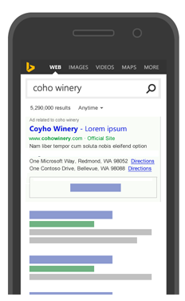

# Bing Ads API Overview
[!INCLUDE[brand](../Bing Ads API Overview/includes/brand.md)] is a pay-per-click (PPC) advertising platform used to display ads based on the keywords used in a user’s search query.  For advertisers placing a large number of ads or developers building advertising tools, the [!INCLUDE[brand](../Bing Ads API Overview/includes/brand.md)] API provides a programmatic interface to [!INCLUDE[brand](../Bing Ads API Overview/includes/brand.md)]. Using the [!INCLUDE[brand](../Bing Ads API Overview/includes/brand.md)] API is the most efficient way to manage many large campaigns or to integrate your marketing with other in-house systems. The [!INCLUDE[brand](../Bing Ads API Overview/includes/brand.md)] API also supports multiple customer accounts making it easy for ad agencies to manage campaigns for many clients. Some organizations may choose a hybrid approach; using the web UI for most tasks but automating reporting or campaign optimization with the API.

-   [Who should use the Bing Ads API](#who)  
-   [Where your ads will appear](#where)  
-   [Enrich your ad layout](#what)  
-   [Show ads to your target audience](#audience)  
-   [Optimize your campaigns](#optimize)  
-   [Join the developer community](#developercommunity)  
-   [Frequently Asked Questions (FAQ)](#faq)
-   [Next steps and navigating the content](#navigatecontent)  

## Who should use the Bing Ads API
You should consider using the [!INCLUDE[brand](../Bing Ads API Overview/includes/brand.md)] API if your business model resembles the following:

-   You are a direct advertiser managing your own ad spend and you want to integrate our PPC marketing with your internal inventory management or conversion tracking systems. For more information, see [Management Model for Direct Advertisers](../Bing Ads API Overview/management-model-for-direct-advertisers.md).  
-   You are a tools vendor developing advertising management solutions for advertisers or agencies. For more information, see [Management Model for Tool Providers](../Bing Ads API Overview/management-model-for-tool-providers.md).  
-   You are an advertising agency and manage ad campaigns for many clients. For more information, see [Management Model for Agencies](../Bing Ads API Overview/management-model-for-agencies.md).  
-   You are a reseller and want to build [!INCLUDE[brand](../Bing Ads API Overview/includes/brand.md)] applications to manage the campaigns of your advertising clients. For more information, see [Management Model for Resellers](../Bing Ads API Overview/management-model-for-resellers.md).  
For [Customer Accounts](../Bing Ads API Overview/customer-accounts.md), you should use the [Customer Management](https://msdn.microsoft.com/library/bing-ads-customer-management-service-reference.aspx) service.  

## Where your ads will appear
When you advertise using Bing Ads, your search ads can appear on the search results page on websites throughout the world. These sites can include Bing, AOL, and Yahoo owned and operated sites as well as Bing, AOL, and Yahoo syndicated search partner sites. (Syndicated search partner sites are sites that use Bing and Yahoo search results.) For more information, see [About ad distribution](https://help.bingads.microsoft.com/#apex/3/en/50871/0). 

Your ads can appear on search results page when a customer does a search on Bing. Where you ad appears on search results pages is determined by the keywords you use to associate your ads. For example, Sarah owns a toy store and wants to create ads for kids’ electronics. She might include keywords like "walkie-talkies", "electronic pets", and "kids’ music players" so her ads could be more relevant to customers’ searches, and show above or next to the search results.

To see where [!INCLUDE[brand](../Bing Ads API Overview/includes/brand.md)] is available and whether your ads will run, please see [Where does Bing Ads show your ads?](https://help.bingads.microsoft.com/#apex/3/en/50873/0) You can also set your ads to the languages your customers speak, which will influence where your ads will appear. For example, if Sarah wants her ads to be in German, her ads can appear not only in Germany but Austria and Switzerland as well. For more information, see [Ad Languages](../Bing Ads API Overview/ad-languages.md).

## Enrich your ad layout
You can extend the ad layout to be more visually appealing and feature rich using [Ad Extensions](#adextensions).

### Ad Extensions
With ad extensions, you can decorate ads with additional information that helps customers find relevant information about your products and services. For example, you can include deep links into your website to quickly direct your customers to relevant promotional or technical information that may help increase conversions. [!INCLUDE[brand](../Bing Ads API Overview/includes/brand.md)] offers the following popular ad extension types. For more information please see [Ad Extensions](../Bing Ads API Overview/ad-extensions.md) and [Bing Ads Web UI Help - What are ad extensions?](http://help.bingads.microsoft.com/#apex/3/en/51001/1).

### Bing Shopping Campaigns
A [!INCLUDE[brand_bsc](../Bing Ads API Overview/includes/brand-bsc.md)] campaign enables you to advertise the products from your [!INCLUDE[storebrand](../Bing Ads API Overview/includes/storebrand.md)] store product catalog. Product ads from a [!INCLUDE[brand_bsc](../Bing Ads API Overview/includes/brand-bsc.md)] campaign include details about the product, an image, and optional promotional text. After you [create a product catalog](http://help.bingads.microsoft.com/#apex/3/en/51105/1), you can then submit the catalog feed using the [Bing Ads Content API](https://msdn.microsoft.com/library/bing-ads-content-api.aspx) or [FTP](http://help.bingads.microsoft.com/#apex/3/en/51086/1). For more information, please see [Product Ads](../Bing Ads API Overview/product-ads.md).

## Show ads to your target audience
Your ads can appear specifically for customers on the go, who use their smartphones and tablets to search and browse the Internet. Or you can create ads that appear on both desktops and smartphones but prioritize where you want the ads to appear more often.

You can show your ads to customers in specific locations, like cities or countries. For example, Sarah wants only local customers to see her ads. She can set your ads to appear to customers within a 20-mile radius around her shop by using radius targeting.

You can also setup your ads to display to users of a certain age group or gender, or to display at a certain day and time of the week. For more information about showing ads to your target audience, see [Show Ads to Your Target Audience](../Bing Ads API Overview/show-ads-to-your-target-audience.md).

## Optimize your campaigns
You will want to optimize your campaign budget and keyword bids for a competitive advantage. The [!INCLUDE[brand](../Bing Ads API Overview/includes/brand.md)] API [Ad Insight](https://msdn.microsoft.com/library/bing-ads-ad-insight-service-reference.aspx) service uses historical performance, web page data, and demographic data to provide data and bid suggestions that you may find helpful as you optimize your campaigns over time. For more information, see [Budget and Bid Opportunities](../Bing Ads API Overview/budget-and-bid-opportunities.md).

Once your campaigns are up and running, you’ll want to monitor their performance using the Bing Ads Reporting service. Bing Ads can generate reports to track ad delivery, budget, and targeting. Each report type aggregates data at a different level and provides different [Report Attributes and Performance Statistics](../Bing Ads API Overview/report-attributes-and-performance-statistics.md). For example, You would use the account and campaign performance reports to monitor click and spend data to ensure that you are optimizing your budget, and you would use the ad and keyword performance reports to identify ads and keywords that are performing well in terms of click-through rate and conversions. For more information, see [Reports](../Bing Ads API Overview/reports.md).

## Join the developer community
The [Bing Ads Developer Center](https://developers.bingads.microsoft.com) aggregates valuable resources for the [!INCLUDE[brand](../Bing Ads API Overview/includes/brand.md)] developer community, including links to getting started, account management, service health dashboard, code samples, support, and feature announcements.

The [blog](http://go.microsoft.com/fwlink/?LinkId=269628) contains technical information about upcoming features not currently in the MSDN documentation; issues that API customers are facing and clarification and/or a solution to those issues; updates about Sandbox availability; and information about when a version of the service is going to sunset.

The [forum](http://go.microsoft.com/fwlink/?LinkId=269629) provides a way for the developer community to ask and answer questions about developing solutions with [!INCLUDE[brand](../Bing Ads API Overview/includes/brand.md)] APIs, to showcase innovations, and to generate and maintain content through community participation. Microsoft monitors the forums and replies to questions that the community has not yet answered.

If you are not finding the information you need to solve your problem in the developer forum, please contact [Bing Ads Support](http://go.microsoft.com/fwlink/?LinkId=269631). To resolve the issue efficiently, please provide support with the details requested in [Engaging Support](../Bing Ads API Overview/handling-service-errors-and-exceptions.md#engagesupport).

## Frequently Asked Questions (FAQ)

### Q. What are the requirements to use the Bing Ads API?
To [get started](https://msdn.microsoft.com/library/bing-ads-getting-started.aspx), you need to sign up for a [Bing Ads](https://secure.bingads.microsoft.com) account, and then get your developer token at the [Developer Portal](https://developers.bingads.microsoft.com/Account). 

### Q. Which programming languages and SDKs are supported?
You can develop [!INCLUDE[brand](../Bing Ads API Overview/includes/brand.md)] applications with any programming language that supports web services. The [Bing Ads Software Development Kits (SDK)](../Bing Ads API Overview/bing-ads-client-libraries.md) enhance the experience of developing [!INCLUDE[brand](../Bing Ads API Overview/includes/brand.md)] applications with .NET, Java, and Python languages.  Each SDK includes a proxy to all Bing Ads API web services and abstracts low level details of authentication with OAuth. You can use the high level BulkServiceManager and ReportingServiceManager interfaces to abstract and execute operations in the low level Bulk and Reporting services. 

Although not in parity with the .NET, Java, and Python SDK features, the [Bing Ads PHP Class Library](https://msdn.microsoft.com/library/bing-ads-overview-getting-started-php-with-web-services.aspx) is available to jump start your PHP application development. 

We have received requests for additional SDKs e.g. Perl and Ruby, although there is no plan to add support in the near term.

### Q. Which API version should I use?
You should always use the latest version as soon as we announce support via the [blog](http://go.microsoft.com/fwlink/?LinkId=269628) or [release notes](../Bing Ads API Overview/release-notes.md). As of May 2017 Version 11 is the highest supported version for Ad Insight, Bulk, Campaign Management API, Customer Billing, Customer Management, and Reporting API. 

### Q. Should I use the Bulk or Campaign Management API?
The [Bulk service](https://msdn.microsoft.com/library/bing-ads-bulk-service-reference.aspx) is recommended, especially if you need to add or update ads and keywords across multiple ad groups or campaigns in an account. Some features are not available in Bulk e.g. [AddUetTags](https://msdn.microsoft.com/library/bing-ads-campaign-management-adduettags.aspx), [GetBMCStoresByCustomerId](https://msdn.microsoft.com/library/bing-ads-campaign-management-getbmcstoresbycustomerid.aspx), [GetGeoLocationsFileUrl](https://msdn.microsoft.com/library/bing-ads-campaign-management-getgeolocationsfileurl.aspx), and [GetMediaByIds](https://msdn.microsoft.com/library/bing-ads-campaign-management-getmediabyids.aspx). For these features of course you must use the [Campaign Management service](https://msdn.microsoft.com/library/bing-ads-campaign-management-service-reference.aspx). 

### Q. Which API performance reports are available and when will my data be available?
The Reporting service supports most of the same [report types](https://msdn.microsoft.com/library/bing-ads-reporting-report-types.aspx) that you can find in the Bing Ads web application. Be sure to check out the [Report Attributes and Performance Statistics](https://msdn.microsoft.com/library/bing-ads-report-attributes-performance-statistics-guide.aspx) and [Reporting Data Retention Time Periods](https://msdn.microsoft.com/library/bing-ads-report-data-retention.aspx) guides for availability details.

When a user clicks an ad, it can take up to two hours for the system to process the click (3 hours for conversions) and make it available for reporting. When all data for the previous day have been processed and made available for reporting, this state is referred to as Books Closed. For more information about when the books are closed for reporting, see [Determining When the Books Close](https://msdn.microsoft.com/library/bing-ads-get-reports-guide.aspx#booksclose).

### Q. I want to run my application without user interaction. How can I authenticate without getting prompted for permission to use Bing Ads credentials?
To programatically manage a Bing Ads account, you must provide consent at least once through the web application consent flow. For repeat or long term authentication, you should follow the [authorization code grant flow](https://msdn.microsoft.com/library/bing-ads-user-authentication-oauth-guide.aspx#authorizationcode) for obtaining an access token and refresh token. Thereafter you can use the latest refresh token to request new access and refresh tokens without any further user interaction. You may need to request user consent again for example, if the Microsoft Account password was changed or the Microsoft Account owner removed permissions for your application to authenticate on their behalf. 

### Q. When do the access and refresh tokens expire?
The access token typically expires after one hour, although you should always check the expiration time each time you request a new token. The refresh token does not have a published duration or expiration time, although you can expect it to last up to 1 year. As a best practice you should always securely store the latest refresh token each time you request new access and refresh tokens. 

## Next steps and navigating the content

|Topic|Description|
|---------|---------------|
|[Entity Hierarchy and Limits](../Bing Ads API Overview/entity-hierarchy-and-limits.md)|Refer to this guide for a high level view of system limits for [!INCLUDE[brand](../Bing Ads API Overview/includes/brand.md)] entities.|
|[Getting Started With the Bing Ads API](../Bing Ads API Overview/getting-started-with-the-bing-ads-api.md)|To use the API, you’ll first need a [!INCLUDE[brand](../Bing Ads API Overview/includes/brand.md)] developer token and valid user credentials. Learn how to get developer credentials and how to write your first application for example, in C#, Java, PHP, or Python.|
|[Sandbox](../Bing Ads API Overview/sandbox.md)|You may test your application in the [!INCLUDE[brand](../Bing Ads API Overview/includes/brand.md)] sandbox environment before deploying it to the production environment.|
|[Client Libraries](../Bing Ads API Overview/bing-ads-client-libraries.md)|You can develop [!INCLUDE[brand](../Bing Ads API Overview/includes/brand.md)] applications with any programming language that supports web services. The Bing Ads Software Development Kits (SDK) enhance the experience of developing [!INCLUDE[brand](../Bing Ads API Overview/includes/brand.md)] applications with .NET, Java, and Python languages.|
|[Code Examples](../Bing Ads API Overview/bing-ads-code-examples.md)|Jump start your development by viewing or using the examples provided in C#, Java, PHP, and Python.|
|[Technical Guides](../Bing Ads API Overview/bing-ads-technical-guides.md)|Learn about how to integrate core advertising solutions using [!INCLUDE[brand](../Bing Ads API Overview/includes/brand.md)] services.|
|[API Reference](../Bing Ads API Overview/bing-ads-api-reference.md)|Browse programming elements such as service operations, data objects, and value sets for each [!INCLUDE[brand](../Bing Ads API Overview/includes/brand.md)] web service.|
|[Release Notes](../Bing Ads API Overview/release-notes.md)|Stay informed about the changes to the [!INCLUDE[brand](../Bing Ads API Overview/includes/brand.md)] services for each release.|
