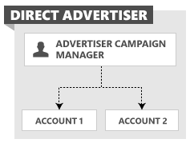

# Management Model for Direct Advertisers
A direct advertiser builds a [!INCLUDE[brand](../../concepts/includes/brand.md)] application for its own advertising campaigns and is billed directly by [!INCLUDE[brand](../../concepts/includes/brand.md)] for valid ad clicks. The following sections describe the entity model and credentials for direct advertisers.

## Direct Advertiser Entity Model
The following figure shows how one or more accounts can be managed directly within one customer.

The users of a direct advertiser can programmatically manage any designated accounts within their own customer, for example Account A and Account B. An application owned and operated by the direct advertiser may be used to manage some or all aspects of an advertiser account. Users can also manage their respective account through the [!INCLUDE[brand](../../concepts/includes/brand.md)] web application or a third-party tool.

## Credentials and Account Access
The following are the header elements and the corresponding identifiers that a direct advertiser would use to authenticate with [!INCLUDE[brand](../../concepts/includes/brand.md)] services. The direct advertiser is the only customer entity in this model and owns each element.

> [!NOTE]
> If you use the *AuthenticationToken*, the *UserName* and *Password* elements are ignored. For more information, see [Authentication with OAuth](../../concepts/authentication-with-oauth.md).

|Header Element|Owner|
|------------------|---------|
|AuthenticationToken|The OAuth access token corresponding to the direct advertiser’s linked Microsoft Account.|
|UserName|The direct advertiser’s user name.|
|Password|The sign-in password of the user specified in UserName.|
|DeveloperToken|The direct advertiser’s token.  **Note:** A single-user (SU) developer token is sufficient to authenticate with the corresponding user. For more information on token types, see [Account Permissions and the Developer Token](../../concepts/customer-accounts.md#accountpermissions).|
|CustomerId|The direct advertiser’s customer ID.|
|CustomerAccountId|A direct advertiser’s account ID.|
For more information about customer and account identifiers, see [Getting Started With the Bing Ads API](../../concepts/getting-started-with-the-bing-ads-api.md).

## See Also
[Customer Accounts](../../concepts/customer-accounts.md)  
[Getting Started With the Bing Ads API](../../concepts/getting-started-with-the-bing-ads-api.md)  

