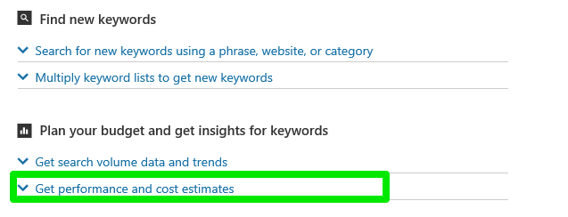

# Keyword Ideas and Traffic Estimates
Choosing keywords is one of the most important aspects of creating and maintaining a successful advertising campaign. But where to start? How do you identify the many possible keywords that describe your business? How much should you bid on those keywords to be competitive with other advertisers?

This guide describes how you can discover [keyword ideas](#keywordideas) and [traffic estimates](#keywordtrafficestimates) for your search advertising campaigns with the the [Ad Insight](~/adinsight-api/ad-insight-service-reference.md) service. The results are similar to using the Keyword Planner tool in the [!INCLUDE[brand](../concepts/includes/brand.md)] web application. For additional keyword research, campaign budget opportunities, and ad group bid opportunities, see [Bid and Budget Opportunities](../concepts/budget-and-bid-opportunities.md). 

> [!NOTE]
> Keyword Planner features are currently available to customers in the United States, United Kingdom, Canada, Australia, France, and Germany.

## Keyword Ideas
Given a list of existing keywords, the [GetKeywordIdeas](~/adinsight-api/getkeywordideas-service-operation.md) operation suggests new ad groups and keywords based on your existing keywords, website, and product category. You can also request historical statistics for keywords e.g., monthly searches, competition, average CPC, and ad impression share. You can use the returned suggested keyword bids as input to the [GetKeywordTrafficEstimates](~/adinsight-api/getkeywordtrafficestimates-service-operation.md) operation.

With the Bing Ads web application's Keyword Planner tool you search for new keywords using a phrase, website, or category as shown in the screen shot below.
 

Likewise with the [GetKeywordIdeas](~/adinsight-api/getkeywordideas-service-operation.md) operation you must specify one or more of the corresponding search parameters.
-  The [QuerySearchParameter](~/adinsight-api/querysearchparameter-data-object.md) corresponds to filling in *Product or service*.
-  The [UrlSearchParameter](https://msdn.microsoft.com/library/bing-ads-ad-insight-urlsearchsearchparameter.aspx) corresponds to filling in *Your landing page*.
-  The [CategorySearchParameter](~/adinsight-api/categorysearchparameter-data-object.md) corresponds to filling in *Your product category*. To get a list of keyword category identifiers, use the [GetKeywordIdeaCategories](~/adinsight-api/getkeywordideacategories-service-operation.md) service operation.

With the Bing Ads web application's Keyword Planner tool you can refine the search for example, by location, language, network, and negative keywords. Likewise with the [GetKeywordIdeas](~/adinsight-api/getkeywordideas-service-operation.md) operation you must specify all of these search parameters: [LanguageSearchParameter](~/adinsight-api/languagesearchparameter-data-object.md), [LocationSearchParameter](~/adinsight-api/locationsearchparameter-data-object.md), and [NetworkSearchParameter](~/adinsight-api/networksearchparameter-data-object.md). 

Each of the [CompetitionSearchParameter](~/adinsight-api/competitionsearchparameter-data-object.md), [DateRangeSearchParameter](~/adinsight-api/daterangesearchparameter-data-object.md), [ExcludeAccountKeywordsSearchParameter](~/adinsight-api/excludeaccountkeywordssearchparameter-data-object.md), [IdeaTextSearchParameter](~/adinsight-api/ideatextsearchparameter-data-object.md), [ImpressionShareSearchParameter](~/adinsight-api/impressionsharesearchparameter-data-object.md), [SearchVolumeSearchParameter](~/adinsight-api/searchvolumesearchparameter-data-object.md), and [SuggestedBidSearchParameter](~/adinsight-api/suggestedbidsearchparameter-data-object.md) are optional. Use these search options to refine what keywords we suggest. You can limit the keywords by historical data, hide keywords already in your account, and include or exclude specific keywords.

::: moniker range=">= netcore-2.0"
[!code-csharp[tableinsert](../../BingAds-dotNet-SDK/examples/BingAdsExamples/BingAdsExamplesLibrary/v11/KeywordPlanner.cs'start=239&end=242 "Table insert")]

::: moniker-end

::: moniker range="< netcore-2.0"

Some version-specific content that applies only to .NET versions prior to .NET Core 2.0.

::: moniker-end

The result is a [KeywordIdea](~/adinsight-api/keywordidea-data-object.md) list. Each keyword idea includes historical statistics for keywords e.g., monthly searches, competition, average CPC, and ad impression share. Whereas the Bing Ads web application returns a 12 month average of the historical monthly search counts, each [KeywordIdea](~/adinsight-api/keywordidea-data-object.md) includes a list of monthly search counts. You can use each count individually or average them for parity with the Bing Ads web application's calculation.

## Keyword Traffic Estimates
Once you have already settled on an initial set of keywords, the [GetKeywordTrafficEstimates](~/adinsight-api/getkeywordtrafficestimates-service-operation.md) operation provides traffic estimates for keywords e.g., average CPC, average position, clicks, CTR, impressions, and total cost. As input you provide the keyword, bid, language, location, and network, with optional campaign budget and negative keyword filters.

With the Bing Ads web application's Keyword Planner tool under *Get performance and cost estimates* you are prompted to either enter keywords or upload a file with keywords. The [GetKeywordTrafficEstimates](~/adinsight-api/getkeywordtrafficestimates-service-operation.md) operation requires that you already have a list of keywords e.g., retrieved via the [GetKeywordIdeas](~/adinsight-api/getkeywordideas-service-operation.md) operation. 

The following inputs are required for the [GetKeywordTrafficEstimates](~/adinsight-api/getkeywordtrafficestimates-service-operation.md) operation.
-  In the *Criteria* element of the [CampaignEstimator](~/adinsight-api/campaignestimator-data-object.md) object you must specify all of these criteria: [LanguageCriterion](~/adinsight-api/languagecriterion-data-object.md), [LocationCriterion](~/adinsight-api/locationcriterion-data-object.md), and [NetworkCriterion](~/adinsight-api/networkcriterion-data-object.md).
- In the *AdGroupEstimators* element of the [CampaignEstimator](~/adinsight-api/campaignestimator-data-object.md) object you must include one or more [AdGroupEstimator](~/adinsight-api/adgroupestimator-data-object.md) objects. Each [AdGroupEstimator](~/adinsight-api/adgroupestimator-data-object.md) must include one or more [KeywordEstimator](~/adinsight-api/keywordestimator-data-object.md) objects. Each [KeywordEstimator](~/adinsight-api/keywordestimator-data-object.md) object must contain the keyword text and match type.

The following inputs are optional for the [GetKeywordTrafficEstimates](~/adinsight-api/getkeywordtrafficestimates-service-operation.md) operation.
- Include exactly one [DeviceCriterion](~/adinsight-api/devicecriterion-data-object.md) in the *Criteria* element of the [CampaignEstimator](~/adinsight-api/campaignestimator-data-object.md) object if you want to filter the results for one device. If you do not specify a device, the returned traffic estimates are aggregated for all devices.
- Include *DailyBudget* with the [CampaignEstimator](~/adinsight-api/campaignestimator-data-object.md) object if you want to constrain the results given a specific campaign daily budget.
- Include *NegativeKeywords* with the [CampaignEstimator](~/adinsight-api/campaignestimator-data-object.md) object if you want to filter the results by specific negative keywords.
- Include *MaxCpc* with the [AdGroupEstimator](~/adinsight-api/adgroupestimator-data-object.md) object if you want to get the results with a specific ad group bid setting.
- Include *MaxCpc* with the [KeywordEstimator](~/adinsight-api/keywordestimator-data-object.md) object if you want to get the results with a specific keyword bid setting.

The result is a [KeywordEstimate](~/adinsight-api/keywordestimate-data-object.md) list for each [AdGroupEstimate](~/adinsight-api/adgroupestimate-data-object.md), which are all nested within one [CampaignEstimate](~/adinsight-api/campaignestimate-data-object.md). Each keyword estimate includes a minimum and maximum [TrafficEstimate](~/adinsight-api/trafficestimate-data-object.md). As previously mentioned, the traffic estimates for keywords include average CPC, average position, clicks, CTR, impressions, and total cost.

## See Also
[Ad Insight Service Reference](~/adinsight-api/ad-insight-service-reference.md)  
[Bing Ads Web Service Addresses](../concepts/bing-ads-web-service-addresses.md)  
