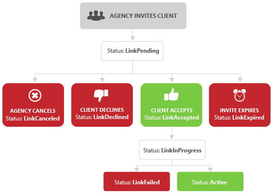
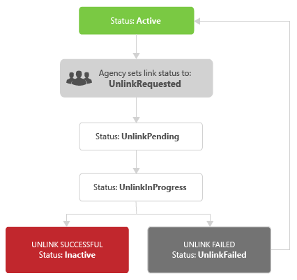

# Management Model for Agencies
An agency builds a [!INCLUDE[brand](../concepts/includes/brand.md)] application for their company to manage the campaigns of their advertising clients. Agencies may manage some or all aspects of an advertiser account. When sending the invitation to manage a client account, the agency may specify whether the client or agency is responsible for billing. For more information about becoming an agency, see [Getting started as an agency with Bing Ads](http://help.bingads.microsoft.com/#apex/3/en/52083/3) or the [Resources for agency partners](https://advertise.bingads.microsoft.com/en-us/resources/bing-partner-program/agency-resources).

> [!NOTE]
> The client account must be set up for post-pay billing. Prepaid accounts are not supported for management by agencies.

## Agency Entity Model
The following figure shows two clients managed by an agency.

Only an agency Super Admin can [Link to Client Accounts](#clientlink). Linking enables any agency Super Admin to access the specified client account. If the client has multiple accounts, then a client link invitation must be sent for each client account. The super admin may also determine which individual accounts the advertiser campaign manager and viewer users can access. In the figure above **User A** has access to account A1, and **User B** has access to accounts A2, B1, and B2. For more information about user roles, see [User Roles and Available Service Operations](../concepts/customer-accounts.md#userroles).

## Link to Client Accounts
[!INCLUDE[sandbox_clientlink](../concepts/includes/sandbox-clientlink.md)] To manage client accounts, a Super Admin user of the agency must send an invitation to the client, which must then be accepted by a Super Admin user of the client. To determine whether a link already exists, call the [SearchClientLinks](~/customer-api/searchclientlinks-service-operation.md) operation and check the Status element of any returned [ClientLink](https://msdn.microsoft.com/library/dn632189.aspx). For a list of possible status values, see [ClientLinkStatus value set](https://msdn.microsoft.com/library/dn632184.aspx). To search by individual account, set the predicate field to ClientAccountId and set the predicate value to the account identifier that you want to find. There is no set limit to the amount of client accounts that can be linked to an agency.

If a link exists with status either Active, LinkAccepted, LinkInProgress, LinkPending, UnlinkInProgress, or UnlinkPending, the agency may not initiate a duplicate client link.

If a client link to the specified account does not yet exist, or if the lifecycle of an existing link had ended with status of Expired, LinkCanceled, LinkDeclined, LinkFailed, or Inactive, then the agency may initiate a new client link invitation by calling the [AddClientLinks](~/customer-api/addclientlinks-service-operation.md) operation. The service transitions client link status to LinkPending immediately.

> [!IMPORTANT]
> The agency may specify whether the client or agency is responsible for billing by setting the *IsBillToClient* element in the service request. If not otherwise specified, the agency will be billed.

To update a client link, the *TimeStamp* element is required for validation, so you must first call the [SearchClientLinks](~/customer-api/searchclientlinks-service-operation.md) operation to get the existing *ClientLink* object. Then modify the *Status* element of the returned *ClientLink*, and include the updated *ClientLink* object in a subsequent call to the [UpdateClientLinks](~/customer-api/updateclientlinks-service-operation.md) operation.

The client may only use the *UpdateClientLinks* operation to update the status as LinkAccepted or LinkDeclined.

> [!NOTE]
> The client may accept or decline through an application built on the [!INCLUDE[brand](../concepts/includes/brand.md)] API, or through the **Accounts &amp; Billing** tab in the [!INCLUDE[brand](../concepts/includes/brand.md)] web application. In either case the client credentials must be used to accept or decline. For more information, see [Accept an agency request](http://advertise.bingads.microsoft.com/help-topic/how-to/moonshot_proc_acceptagencyinvitation.htm/accept-an-agency-request).

If the client sets the status to LinkDeclined, the client link lifecycle ends. You may not update a declined client link, and you must send a new invitation to manage the client account. If the client sets the status to LinkAccepted, the status transitions to LinkInProgress. If the link process succeeds, the service updates the client link status to Active.

If the link process fails, possibly due to a billing transition error, the service updates the client link status to LinkFailed. You may not update a failed client link, and you must send a new invitation to manage the client account.

If the client or agency does not take action within 30 days, the service sets the status to LinkExpired and the client link lifecycle ends. You may not update an expired client link, and you must send a new invitation to manage the client account.

*Figure: Link Status Flow*

If the client link status is LinkPending, the agency may choose to cancel a prior link request. If the client link status is Active, the agency may choose to initiate the unlink process, which would terminate the existing relationship with the client.

To initiate the unlink process, the agency sets the client link status to UnlinkRequested and calls the [UpdateClientLinks](~/customer-api/updateclientlinks-service-operation.md) operation. Updating the status with UnlinkRequested effectively sets the status to UnlinkInProgress. The service transitions client link status to UnlinkPending immediately, and then waits for system resources to proceed. The state should transition quickly to UnlinkInProgress.

If the unlink process fails, possibly due to a billing transition error, the client link resumes to Active status. If the unlink process succeeds the status will update to Inactive, and the client link lifecycle ends. You may not update an inactive client link, and you must send a new invitation to manage the client account.

*Figure: Unlink Status Flow*

For code examples that show how to add and update a client link invitation, see [ C&#35;](../concepts/link-to-client-accounts-in-csharp.md) | [Java](../concepts/link-to-client-accounts-in-java.md) | [PHP](../concepts/link-to-client-accounts-in-php.md) | [Python](../concepts/link-to-client-accounts-in-python.md).

## Credentials and Account Access
The following are the header elements and the corresponding identifiers that an agency would use.

> [!NOTE]
> If you use the *AuthenticationToken*, the *UserName* and *Password* elements are ignored. For more information, see [Authentication with OAuth](../concepts/authentication-with-oauth.md).

|Header Element|Owner|
|------------------|---------|
|AuthenticationToken|The OAuth access token corresponding to the agency's linked Microsoft Account.|
|UserName|The sign-in user name.  **Note:** For agencies, this is the username within the agency?s customer shell that has the Super Admin, Advertiser Campaign Manager, or Viewer role. For more information see [Account Permissions and the Developer Token](../concepts/customer-accounts.md#accountpermissions) and [User Roles and Available Service Operations](../concepts/customer-accounts.md#userroles) within [Customer Accounts](../concepts/customer-accounts.md).|
|Password|The sign-in password of the user specified in UserName.|
|DeveloperToken|The agency?s token.  **Note:** It is recommended for an agency to use the multi-user developer token to authenticate with any agency user. An agency needs only one such token. It is not necessary to request a single-user token for each user. For more information about token types, see [Account Permissions and the Developer Token](../concepts/customer-accounts.md#accountpermissions).|
|CustomerId|The identifier of the customer that contains and owns the account. If you manage an account of another customer, you should use that customer ID instead of your own customer ID. |
|CustomerAccountId|A managed customer's account ID.|
For more information about customer and account identifiers, see [Getting Started With the Bing Ads API](../concepts/getting-started-with-the-bing-ads-api.md).

## See Also
[Customer Accounts](../concepts/customer-accounts.md)  
[Getting Started With the Bing Ads API](../concepts/getting-started-with-the-bing-ads-api.md)  

