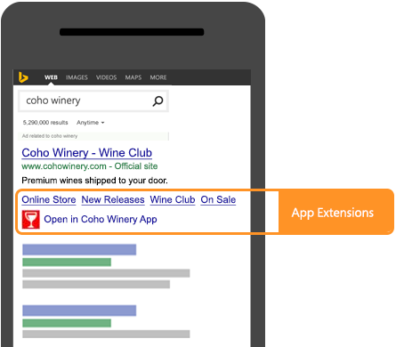
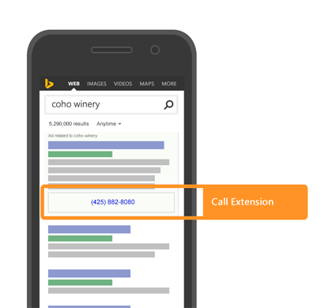
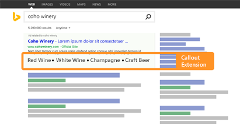
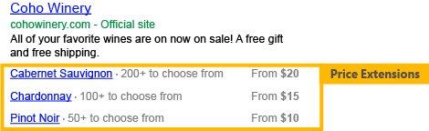
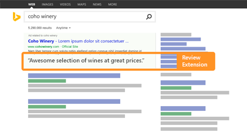
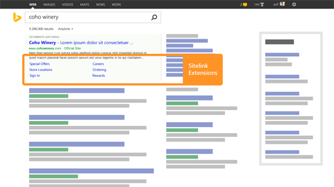

# Ad Extensions
Ad extensions are additional pieces of information about your business, like a phone number or a link to a specific page on your website, you can add to your ads. Ad extensions are free to add to your ads, with the usual charges for any clicks you get. Including ad extensions can improve the visibility of your ads, which can lead to more clicks and improve your ROI. There are many types of ad extensions available in Bing Ads: [App Extensions](#appextensions), [Call Extensions](#callextensions), [Callout Extensions](#calloutextensions), [Image Extensions](#imageextensions), [Location Extensions](#locationextensions), [Price Extensions](#priceextensions), [Review Extensions](#reviewextensions), [Sitelink Extensions](#sitelinkextensions), and [Structured Snippet Extensions](#structuredsnippetextensions). For more about ad extensions, see [Bing Ads Web Application Help - What are ad extensions?](http://help.bingads.microsoft.com/#apex/3/en/51001/1)

> [!TIP]
> Providing extension data allows our algorithms to evaluate all the possible layouts for your ad. It increases the changes of additional space being allocated and increasing clicks for your ad.

Ad extensions are stored in a shared library at the account level. After adding the extension to your shared library, you must also explicitly associate it with the account or one or more campaigns or ad groups within the account for the extension to become eligible for delivery. For more details on associating ad extensions, see [Managing Ad Extensions with the Bulk Service](#bulkservice) and [Managing Ad Extensions with the Campaign Management Service](#campaignservice) in the sections below. For ad extension association limits per entity, please see [Entity Limits for Ad Extensions](../guides/entity-hierarchy-and-limits.md#adextensions).

> [!NOTE]
> Call ad extensions can only be associated at the campaign level. 
> 
> Location ad extensions can only be associated at the account and campaign level i.e., cannot be associated with ad groups.

Ad extensions that are associated at a lower level e.g., ad group will override ad extensions of the same type that are associated at a higher level e.g., campaign. For example if you have 2 callout extensions set for *Campaign A*, zero callout extensions associated with *Ad Group AA*, and one callout extension associated with *Ad Group AB*, then only *Ad Group AA* is eligible to have its ads decorated with callouts. 

You can manage ad extensions with either the [Bulk Service](https://msdn.microsoft.com/library/bing-ads-bulk-service-reference.aspx) or [Campaign Management Service](https://msdn.microsoft.com/library/bing-ads-campaign-management-service-reference.aspx). You should use the [Bulk Service](https://msdn.microsoft.com/library/bing-ads-bulk-service-reference.aspx) if you need to upload or download a high volume of entity settings. For example you can update all ad extensions for your entire account in a single upload. In comparison, with the [Campaign Management Service](https://msdn.microsoft.com/library/bing-ads-campaign-management-service-reference.aspx) you can only update 100 ad extensions per call. For details see the following sections.

-   [Ad Extension Types](#adextensiontypes)  
-   [Managing Ad Extensions with the Bulk Service](#bulkservice)  
-   [Managing Ad Extensions with the Campaign Management Service](#campaignservice)  
-   [Editorial Review](#editorial)  
-   [Reporting](#reporting)  

## Ad Extension Types

-   [App Extensions](#appextensions)  
-   [Call Extensions](#callextensions)  
-   [Callout Extensions](#calloutextensions)  
-   [Image Extensions](#imageextensions)  
-   [Location Extensions](#locationextensions)  
-   [Price Extensions](#priceextensions)  
-   [Review Extensions](#reviewextensions)  
-   [Sitelink Extensions](#sitelinkextensions)  
-   [Structured Snippet Extensions](#structuredsnippetextensions)  

### App Extensions
You can associate app ad extensions with your campaigns and ad groups, and your ads will include a link to install an application.

### Call Extensions
With Call Extensions, you can provide a phone number that is not associated with a particular location, but is appropriate for all locations where your ads display. In comparison, you typically use Location Extensions to provide an address and local phone number associated with a local location.

If the campaign is also associated with a [Location Extensions](#locationextensions), the call extension phone number will override the location extension phone number.

### Callout Extensions
With Callout Extensions, you can provide an extra snippet of text that highlights your business, products, or services to include in An ad. This extension is not clickable and can appear in addition to your ad’s description. Providing additional details about your store can make your ad more relevant to potential customers.

Each account, campaign, or ad group can be associated with between 2 and 20 callout ad extensions. If you associate one or fewer callout extensions with your account, campaign, or ad group, no callout text will serve with your ad. An ad may include between 2 to 4 callouts per impression.

### Image Extensions
You can associate image ad extensions with your campaigns and ad groups, and your ads may include an image or alternative text.

### Location Extensions
When you enable Location Extensions, you can choose to show the address of your business location that is closest to the customer and also include a local phone number. Better yet, if the customer is viewing your ad on a smartphone, they can click that number to give you a call.

If the campaign is also associated with a [Call Extensions](#callextensions), the phone number in the call extension will override the location extension phone number.

### Price Extensions
You can use Price Extensions to display your products or services with their corresponding prices to potential customers on mobile devices. Price Extensions only show on ads listed at the top of the results page, helping to increase your clicks. Keep in mind that though Price Extensions are free to add to your ad, they may not always show for every query.

### Review Extensions
Potential customers like to know about other customers’ experiences when searching for products or services. Share positive reviews from a reputable third-party source about your business, products, or services in your ads with a Review Extension. An ad will only include one review per impression.

### Sitelink Extensions
Sitelink Extensions are additional links in your ads that take customers to specific pages on your website. This allows you to promote certain products, services, or sections of your website and take potential customers to exactly the information they were searching for. This can increase both click-through-rate and conversions.

You may associate site links ad extensions with your campaigns or ad groups, and your ads will include up to 10 links to relevant web pages within your website. When displaying an ad, [!INCLUDE[brand](../guides/includes/brand.md)] determines which links are most relevant to the ad being displayed and includes those with your ad. You can influence which links are included. Links that you specify at the beginning of your list receive higher priority than those toward then end of your list.

### Structured Snippet Extensions
Structured Snippet Extensions give potential customers more context on a specific aspect of your products and services. A Structured snippet is made up of a header and a list of 3-10 values which correspond to the header. For example, you might use the header “Brands:” and the values “Windows, Xbox, Skype” to let customers know about what brands are available at your store.

This extension is not clickable and, similar to other extensions, will appear beneath your ad’s description. Structured Snippets have no impact on the other extensions you’re already using. Structured Snippets should not duplicate what is already stated in the ad. Our full list of Structured Snippet policies can be found [here](https://advertise.bingads.microsoft.com/resources/policies/ad-extensions-policies).

An ad will only include one structured snippet (one headline with 3 - 10 values) per impression. Keep in mind that your ads won’t always show Structured Snippets and if they do show Structured Snippets, the format they appear may vary. Structured Snippets are free to add to your ad, available in all Bing Ads markets (excluding Hong Kong and Taiwan), and serve on desktop and tablet devices. 

## Managing Ad Extensions with the Bulk Service
You can use the [Bulk Service](https://msdn.microsoft.com/library/bing-ads-bulk-service-reference.aspx) i.e., [Bulk Download and Upload](../guides/bulk-download-and-upload.md) to create, get, update, and delete both ad extensions and ad extension associations. 

The following Bulk records are available for managing ad extensions and ad extension associations. 

### App Extensions
-   [App Ad Extension](https://msdn.microsoft.com/library/bing-ads-bulk-app-ad-extension-record.aspx)
-   [Ad Group App Ad Extension](https://msdn.microsoft.com/library/bing-ads-bulk-ad-group-app-ad-extension-record.aspx)
-   [Campaign App Ad Extension](https://msdn.microsoft.com/library/bing-ads-bulk-campaign-app-ad-extension-record.aspx)

### Call Ad Extensions
-   [Call Ad Extension](https://msdn.microsoft.com/library/bing-ads-bulk-call-ad-extension-record.aspx)
-   [Campaign Call Ad Extension](https://msdn.microsoft.com/library/bing-ads-bulk-campaign-call-ad-extension-record.aspx)

### Callout Ad Extensions
-   [Callout Ad Extension](https://msdn.microsoft.com/library/bing-ads-bulk-callout-ad-extension-record.aspx)
-   [Ad Group Callout Ad Extension](https://msdn.microsoft.com/library/bing-ads-bulk-ad-group-callout-ad-extension-record.aspx)
-   [Campaign Callout Ad Extension](https://msdn.microsoft.com/library/bing-ads-bulk-campaign-callout-ad-extension-record.aspx)

### Image Ad Extensions
-   [Image Ad Extension](https://msdn.microsoft.com/library/bing-ads-bulk-image-ad-extension-record.aspx)
-   [Ad Group Image Ad Extension](https://msdn.microsoft.com/library/bing-ads-bulk-ad-group-image-ad-extension-record.aspx)
-   [Campaign Image Ad Extension](https://msdn.microsoft.com/library/bing-ads-bulk-campaign-image-ad-extension-record.aspx)

### Location Ad Extensions
-   [Location Ad Extension](https://msdn.microsoft.com/library/bing-ads-bulk-location-ad-extension-record.aspx)
-   [Campaign Location Ad Extension](https://msdn.microsoft.com/library/bing-ads-bulk-campaign-location-ad-extension-record.aspx)

### Price Ad Extensions
-   [Price Ad Extension](https://msdn.microsoft.com/library/bing-ads-bulk-price-ad-extension-record.aspx)
-   [Ad Group Price Ad Extension](https://msdn.microsoft.com/library/bing-ads-bulk-ad-group-price-ad-extension-record.aspx)
-   [Campaign Price Ad Extension](https://msdn.microsoft.com/library/bing-ads-bulk-campaign-price-ad-extension-record.aspx)

### Review Ad Extensions
-   [Review Ad Extension](https://msdn.microsoft.com/library/bing-ads-bulk-review-ad-extension-record.aspx)
-   [Ad Group Review Ad Extension](https://msdn.microsoft.com/library/bing-ads-bulk-ad-group-review-ad-extension-record.aspx)
-   [Campaign Review Ad Extension](https://msdn.microsoft.com/library/bing-ads-bulk-campaign-review-ad-extension-record.aspx)

### SiteLinks Ad Extensions
-   [Sitelink Ad Extension](https://msdn.microsoft.com/library/bing-ads-bulk-sitelink-ad-extension-record.aspx)
-   [AdGroup Sitelink Ad Extension](https://msdn.microsoft.com/library/bing-ads-bulk-ad-group-sitelink-ad-extension-record.aspx)
-   [Campaign Sitelink Ad Extension](https://msdn.microsoft.com/library/bing-ads-bulk-campaign-sitelink-ad-extension-record.aspx)

### Sitelink2 Ad Extensions
-   [Sitelink2 Ad Extension](https://msdn.microsoft.com/library/bing-ads-bulk-sitelink2-ad-extension-record.aspx)
-   [Ad Group Sitelink2 Ad Extension](https://msdn.microsoft.com/library/bing-ads-bulk-ad-group-sitelink2-ad-extension-record.aspx)
-   [Campaign Sitelink2 Ad Extension](https://msdn.microsoft.com/library/bing-ads-bulk-campaign-sitelink2-ad-extension-record.aspx)

### Structured Snippet Ad Extensions
-   [Structured Snippet Ad Extension](https://msdn.microsoft.com/library/bing-ads-bulk-structured-snippet-ad-extension-record.aspx)
-   [Ad Group Structured Snippet Ad Extension](https://msdn.microsoft.com/library/bing-ads-bulk-ad-group-structured-snippet-ad-extension-record.aspx)
-   [Campaign Structured Snippet Ad Extension](https://msdn.microsoft.com/library/bing-ads-bulk-campaign-structured-snippet-ad-extension-record.aspx)

For code examples that show how to set up ad extensions using the Bulk service, see [C&#35;](../guides/bulk-ad-extensions-in-csharp.md)| [Java](../guides/bulk-ad-extensions-in-java.md) | [Python](../guides/bulk-ad-extensions-in-python.md).

## Managing Ad Extensions with the Campaign Management Service
You can use the [Campaign Management Service](https://msdn.microsoft.com/library/bing-ads-campaign-management-service-reference.aspx) to create, get, update, and delete both ad extensions and ad extension associations. 

For code examples that show how to set up ad extensions using the Campaign Management service, see [C&#35;](../guides/ad-extensions-in-csharp.md) | [Java](../guides/ad-extensions-in-java.md) | [PHP](../guides/ad-extensions-in-php.md) | [Python](../guides/ad-extensions-in-python.md).

### Entities
These are the ad extension entities that can be accessed using the [Campaign Management Service](https://msdn.microsoft.com/library/bing-ads-campaign-management-service-reference.aspx). You can create, read, update, and delete these entities.

-   [AppAdExtension](https://msdn.microsoft.com/library/bing-ads-campaign-management-appadextension.aspx)
-   [CallAdExtension](https://msdn.microsoft.com/library/bing-ads-campaign-management-calladextension.aspx)
-   [CalloutAdExtension](https://msdn.microsoft.com/library/bing-ads-campaign-management-calloutadextension.aspx)
-   [ImageAdExtension](https://msdn.microsoft.com/library/bing-ads-campaign-management-imageadextension.aspx)
-   [LocationAdExtension](https://msdn.microsoft.com/library/bing-ads-campaign-management-locationadextension.aspx)
-   [PriceAdExtension](https://msdn.microsoft.com/library/bing-ads-campaign-management-priceadextension.aspx)
-   [ReviewAdExtension](https://msdn.microsoft.com/library/bing-ads-campaign-management-reviewadextension.aspx)
-   [SiteLinksAdExtension](https://msdn.microsoft.com/library/bing-ads-campaign-management-sitelinksadextension.aspx)
-   [Sitelink2AdExtension](https://msdn.microsoft.com/library/bing-ads-campaign-management-sitelink2adextension.aspx)
-   [StructuredSnippetAdExtension](https://msdn.microsoft.com/library/bing-ads-campaign-management-structuredsnippetadextension.aspx)

> [!NOTE]
> The [AdExtension](https://msdn.microsoft.com/library/bing-ads-campaign-management-adextension.aspx) object is the base class from which all ad extensions are derived.

### Service Operations
These are the [Campaign Management Service](https://msdn.microsoft.com/library/bing-ads-campaign-management-service-reference.aspx) service operations that can be used to add, get, update, and delete ad extensions.

-   [AddAdExtensions](https://msdn.microsoft.com/library/dn236319.aspx)  
-   [SetAdExtensionsAssociations](https://msdn.microsoft.com/library/bing-ads-campaign-management-setadextensionsassociations.aspx)  
-   [GetAdExtensionsByIds](https://msdn.microsoft.com/library/bing-ads-campaign-management-getadextensionsbyids.aspx)  
-   [GetAdExtensionIdsByAccountId](https://msdn.microsoft.com/library/bing-ads-campaign-management-getadextensionidsbyaccountid.aspx)  
-   [GetAdExtensionsAssociations](https://msdn.microsoft.com/library/bing-ads-campaign-management-getadextensionsassociations.aspx)  
-   [UpdateAdExtensions](https://msdn.microsoft.com/library/bing-ads-campaign-management-updateadextensions.aspx)
-   [DeleteAdExtensions](https://msdn.microsoft.com/library/bing-ads-campaign-management-deleteadextensions.aspx)  
-   [DeleteAdExtensionsAssociations](https://msdn.microsoft.com/library/bing-ads-campaign-management-deleteadextensionsassociations.aspx)

> [!NOTE]
> Partial update is not supported for ad extensions. Any optional elements which are not sent with the [UpdateAdExtensions](https://msdn.microsoft.com/library/bing-ads-campaign-management-updateadextensions.aspx) request will in effect be deleted from the extension.
> 
> Partial success is not supported when adding, updating, and deleting ad extensions. For example if you submit 10 ad extensions and 2 fail, the entire batch will fail.
> 
> Partial success is supported for [GetAdExtensionsAssociations](https://msdn.microsoft.com/library/bing-ads-campaign-management-getadextensionsassociations.aspx) and [SetAdExtensionsAssociations](https://msdn.microsoft.com/library/bing-ads-campaign-management-setadextensionsassociations.aspx). For example if you submit 10 ad extension associations and 2 fail, the remaining 8 will succeed. For more information, see [Partial Success using the Campaign Management Service](../guides/handling-service-errors-and-exceptions.md#partialsuccess).

## Editorial Review
When you associate an ad extension with a campaign or ad group, the extension goes through an initial editorial review. For more information, see [Ad Extension Editorial Review](../guides/editorial-review-and-appeals.md#adextensioneditorialreview).

## Reporting
You can use the following reports to get statistics about the effectiveness of the ad extensions that you've included in your ads.

-   [AdExtensionByAdReportRequest](https://msdn.microsoft.com/library/bing-ads-reporting-adextensionbyadreportrequest.aspx) – Aggregates performance data by ad for a specified time period. By including performance details, such as clicks, conversion, and spend, you can identify ad extensions that are performing well, and those that may need to be adjusted to optimize the monthly budget.

-   [AdExtensionByKeywordReportRequest](https://msdn.microsoft.com/library/bing-ads-reporting-adextensionbykeywordreportrequest.aspx) – Aggregates performance data by keyword for a specified time period. By including performance details, such as clicks, conversion, and spend, you can identify ad extensions that are performing well, and those that may need to be adjusted to optimize the monthly budget.

-   [AdExtensionDimensionReportRequest](https://msdn.microsoft.com/library/bing-ads-reporting-adextensiondimensionreportrequest.aspx) – Lists all versions of an ad extension by account. You can use this information along with the performance data from the other two reports to determine which version performed better.

For more information about reporting, see [Reports](../guides/reports.md) and [Request and Download a Report](../guides/request-and-download-a-report.md).

## See Also
[Bing Ads Web Service Addresses](../guides/bing-ads-web-service-addresses.md)

